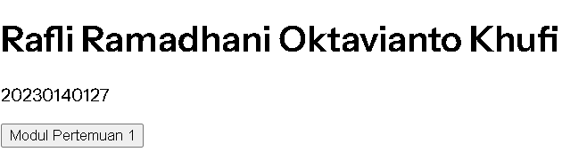

Tampilan/about

Register 

Login 

TUGAS 3

ERD 

DATABASE 

MIGRATION PRODUK 

MIGRATION KATEGORI 

MODEL PRODUK 

MODEL KATEGORI 

TUGAS 4

CREATE 

UPDATE 

DELETE 

TUGAS 5

Pengujian 1 — Persiapan Role untuk mengetahaui role nya dengan commant php artisan tinker

Pengujian 2 — Gate manage-product Admin melihat menu Product di navigasi (dapat melihat tombol Delete,Edit,Detail untuk semua produk admin)

Di Navbar Regular User menu Product tidak muncul

Regular user mendapat 403 saat coba edit produk milik orang lain

Pengujian 3 Policy admin pilih User Reguler sebagai Owner

Tombol Edit & Delete hanya muncul untuk produk milik sendiri (regular user)

